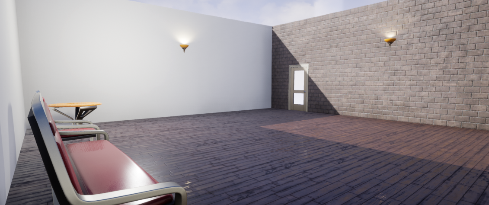

# BuildingEscape

A simple game where you must escape a room by stacking enough objects on a pressure plate to keep the exit door open.

This is my personal implementation of the project with the same name from "The Unreal Engine Developer Course" on Udemy.

**Controls**: Hold left click / E to pick up props, and release to drop them.

### Features:
- Built using the Unreal starter content
- Optimized from the original course implementation: door closing and opening is done using events instead of polling
